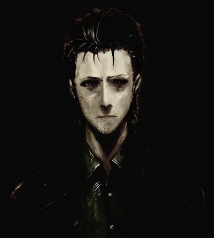

  

<b>Computer Engineer specialized in systems and infrastructure security.</b> 
Main languages: <b>C</b>, <b>C++</b>, and <b>Go</b>. 
Passionate about breaking through and discovering the inner workings of everything. 
Also interested in CUDA, NVIDIA, graphics and game programming.

<b>📊 Stats</b>

## Status
<!--img src="https://github-readme-stats.vercel.app/api?username=h4n0sh1&count_private=true&theme=chartreuse-dark" height="320" width="450"/-->
<!--img src="https://github-readme-stats.vercel.app/api/top-langs/?username=h4n0sh1&layout=compact&theme=chartreuse-dark"  width="375" /-->

